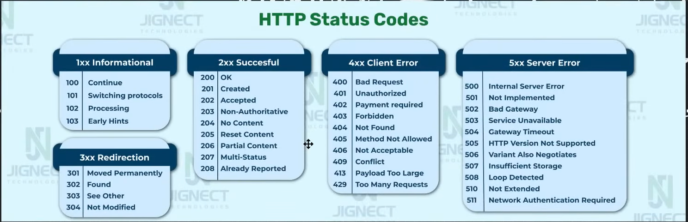
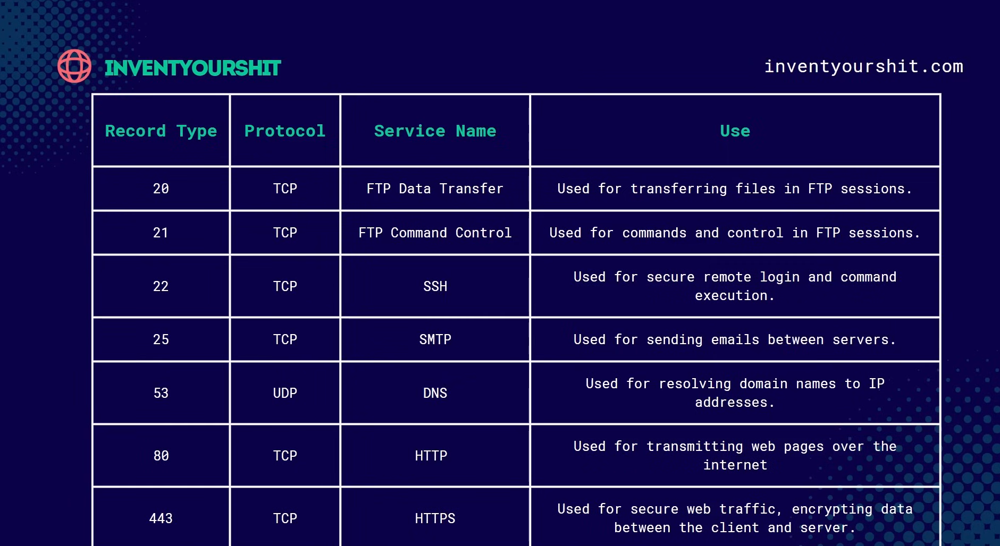

## HTTP Status Codes:

- 1XX = Information Codes
- 2XX = Success Codes
- 3XX = Redirection Codes
- 4XX = Client error codes
- 5XX = Server error codes



## Cookies. How do Cookies work ?

1. The webpage you visit sends a cookie that contains unique data about your visit to you web browser
2. You web browser stores the cookie and sends it back to the webpage the next time you visit
3. The website's server reads the cookie and adapts to the user's last visit preferences.

---

# Module 2

## Reconnaissance

**What is Reconnaissance ?**
Reconnaissance is the initial phase of a penetration test or security assessment where the hacker gathers as much information as possible about a target system or network. This phase helps the ethical hacker understand the system's architecture, vulnerabilities, and potential points of entry, with the goal of identifying weaknesses before attempting any exploits.

## Subdomain Enumeration : Hunting those subdomains

**What are subdomains?**
A subdomain is a part of a larger domain name. It helps organize and navigate different sections or areas of a website. In a web address, the subdomain appears before the main domain name

-> kali Machine

```bash

# Install SubFinder
$ cd Download
$ unzip subfinder.zip
$ sudo mv subfinder /usr/local/bin/
$ subfinder -d rockstargames.com -all
$ subfinder -d rockstargames.com -all -o target.txt
# mousepad subfinder.txt

# ---
$ amass enum -d rockstargames.com # saved all the content
$ grep -E '\b([a-zA-Z0-9_-]+\.)+rockstargames\.com\b' amass.txt > amass_final.txt

# ---
dnsx -v

```

- In all those subdomain filter out how many visible website are there

```bash
# Unzip httpx

$ unzip httpx
$ sudo mv httpx /usr/local/bin
$ httpx

$ cat final_subdomain.txt | httpx -o targets.txt -status-code -location -title -tech-detect
```

## Port Scanning : Explore those open port

**What are Port?**
In computer networking , ports are like doorways or entry points that allow different types of data to flow in and out of a device or network. Each port is associated with a specific service or application, so different types of data are directed to the correct program.

**What are protocols?**
Protocols are sets of rules or standards that define how data is transmitted and received between devices. They ensure that devices (such as computers, smartphones, and servers) can communicate with each other in a way that everyone understands, regardless of the manufacturer or type of device.



**Port Scanning (NAMP)**

```bash
# Nmap
sudo nmap -sV -sS Domain_Name

```

## Directory Bruteforcing: Find Hidden Directories

**What is a Directory**
A directory on a web server is like a folder on your computer. It contains files or other folders

- For example, on a website, /images/ could be a directory containing all the pictures.
- Directories help organize files so the website knows where to find things.

**What is Directory BruteForcing?**
Directory bruteforcing is a technique where a bug bounty hunter tries to find hidden or listed directories or files on a web server by guessing or using a list of common folder/file names

- Imagine a building with many doors.
- Some doors are labeled clearly (linked on the website)
- Directory bruteforcing is like trying many door names to find hidden rooms inside the building

tools: ferobuster