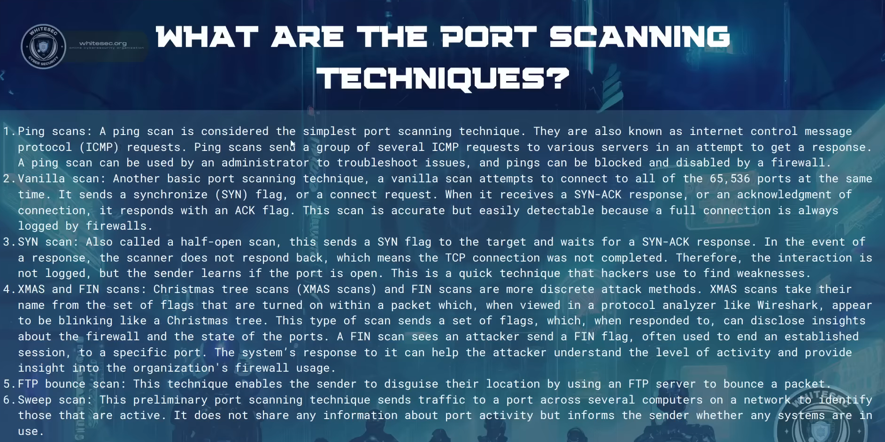
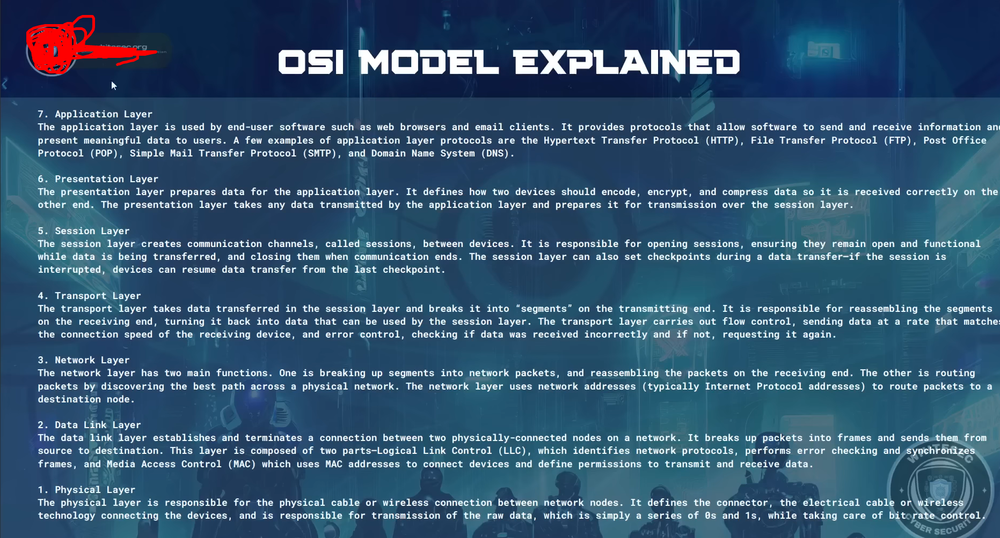
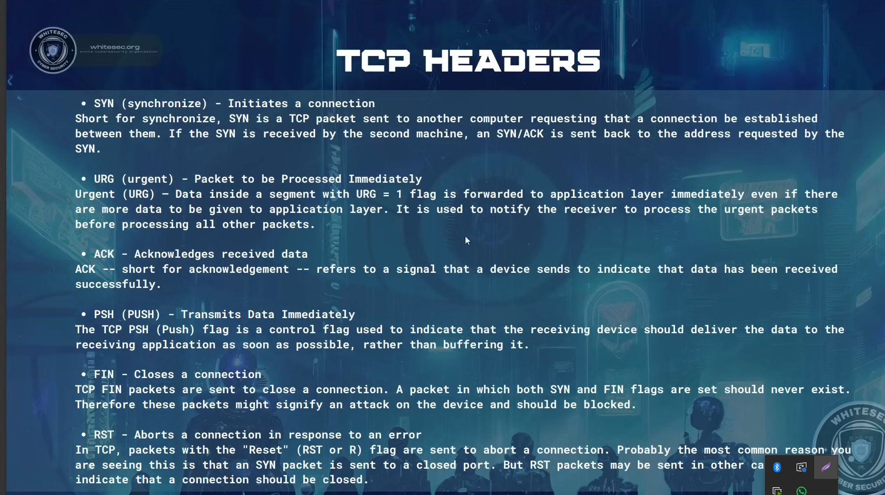

- **What is NMAP?**
  - Nmap is short for Network Mapper. it is an open-source Linux command-line tool that is used to scan Ip address and ports in a network and to detect installed applications.
  - Nmap allows network admins to find which devices are running on their network discover open ports and services, and detect vulnerabilities.

- **Why use NMAP**
  - There are a number of reasons why security pros prefer Nmap over scanning tools. First Nmap hells you to quickly map out a network without sophisticated commands or configurations. It also supports simple commands and complex scripting through the Nmap scripting engine.

- **What is a PORT Scan?**
  - A port scan is a common technique hackers use to discover open doors or weak points in a network. A port scan attack helps cyber criminals find open ports and figure out whether they are receiving or sending data. It can also reveal whether active security devices like firewalls are begin used by an organization

- **Port scanning can provide information such as :**
  - Services that are running
  - Users who own services
  - Whether anonymous logins are allowed
  - Which network services require authentication

- **Port Scanning Techniques**
  - Ping Scans
  - Vanilla Scan
  - SYN Scan
  - XMAS and FIN
  - FTP bounce scan
  - Sweep scan



- **What is the OSI MODEL**
  - The Open Systems interconnection (OSI) model describes seven layers that computer systems use to communicate over a network.

- **7 layers of OSI Model**
  - Application
  - Presentation
  - Session
  - Transport
  - Network
  - Data Link
  - Physical



- Command to run wireshark

```bash
sudo wireshark
```

---

- To perform nmap in a target machine Enter

```bash
# nmap command
# nmap [Scan Type(s)] [Options] {target specification}

# It is for TCP
$ nmap <private_ip>/<public_ip>
$ nmap -sT 192.168.216.129
$ nmap 192.168.216.129

# To perform the UDP in the target node
$ sudo nmap -sU ip
$ sudo nmap -sU 192.168.216.129

# To scan all the port both UDP and TCP
$ sudo nmap -sU -sP -p- <ip>

# To a spec port
$ nmap -st -p111 <ip>

```

---

# TCP Headers

- _SYN (synchronize) - Initiates a connection_
  - Short for synchronize, Syn is a TCP packet sent to another computer requesting that a connection be established between them. If the SYN is received by the second machine, an SYN/ACK is sent back to the address requested by the SYN
- _URG (urgent) - Packet to be Processed Immediately_
  - Urgent (URG) - Data inside a segment with URG = 1 flag is forward to application layer immediately even if there are more data to be given to application layer. It is used to notify the receiver to process the urgent packets before processing all other packets
- _ACK - Acknowledges received data_
  - ACK - Short for acknowledgement - refers to a signal that a device sends to indicate that data has been received successfully.
- _PSH (PUSH) - Transmit Data Immediately_
  - THE TCP PSH (push) flag is a control flag used to indicate that the receiving device should deliver the data to the receiving application as soon as possible, rather than buffering it.
- _FIN - Closes a connection_
  - TCP FIN packets are sent to close a connection. A packet in which both SYN and FIN flags are set should never exist. Therefore these packets might signify an attack on the device and should be blocked
- _RST - Aborts a connection in response to an error_
  - In TCP, packets with the "Reset" (RST or R) flag are sent to abort a connection. Probably the most common reason you are seeing this is that an SYN packet is sent to a closed port.



---

- **3 Way Handshake**
  - A three-way handshake is primarily used to create a TCP socket connection to reliable transmit data between devices.
  - For example, it supports communication between a web browser on the client side and a server every time a user navigates The Internet
  - As soon as a client requests a connection session with server, a three-way handshake process initiates TCP traffic by following three steps

---

## Step 1 : A connection between server and client is established

- First, a connection between server and client is established, so the target server must have open ports that can accept and initiate new connections. The client node sends a SYN (Synchronize Sequence Number) Data packet over an Ip network to a server on the same or an external network.

- This SYN packet is a random sequence number that the client wants to use for the communication (for example, X). The objective of this packet is to ask/infer if the server is open for new connections

## Step 2: The server receives the syn packet from th client node

- When the server receives the syn packet from the client node, it responds and returns a confirmation receipt - the ACK
  (Acknowledgement Sequence Number) packet or Syn/ACK packet. This packet includes two sequence numbers.
- The first one is ACK one, which is set by the server to one more than the sequence number it received from the client (e.g. X+1)
- The second one is the SYN sent by the server, which is another random sequence number (For example, Y)
- This sequence indicates that the server correctly acknowledged the client's packet, and that is sending its own to be acknowledged as well

## step 3: Client node Receives the SYN/ACK from the server and responds with an ACK Packet

- The client node receives the SYN/ACK from the server and responds with an ACK packet. Once again, Each side must acknowledge the sequence number received by incrementing it by one.
- So now it's the turn of the client to acknowledge the server's packet by adding one to the Upon completion of this process, the connection is created and the host and server can communicate
- All these steps are necessary to verify the serial numbers originated by both sides, guaranteeing the stability of the connection

---

## Network Discover

- Host Discovery
  - Ping Scan

```bash
# Check the command in nmap

$ man nmap

$  nmap -sn <ip> # Find out if the target server is running or not

```

```bash
$ sudo netdiscover -i eth0 # Scan the eth0 network

$ sudo netdiscover -i docker0

$ nmap -sn 192.168.0.0/16

$ ip addr # Check the IP address

# To scan a list of Ip address in a file add some ip like 192.168.10.10 192.168.10.50
$ nmap -sn -iL <file_path>

# To avoid some specific ip address
$ nmap -sn 192.168.186.1-225 --excludefile /path_file
```

---

# New

- To Perform an attack first we need to know that if the server is live or not to check the server live or not

```bash
ping <ip>
nmap -sn <ip>
```

- ARP Scan of Firewall

```bash
$ sudo nmap -sn <firewall_device_IP> -PR
```

- **Port States**
  - _Open_ : Open indicates that a service is listening for connections on this port
  - _Closed_ : Closed indicates that the probs were received, But it was concluded there was no service running on this port
  - _Filtered_ : Filtered indicates that there were no signs that the probes were received and the state could not be established. It also indicates that the probes are being dropped by some kind filtering
  - _Unfiltered_ : Unfiltered indicates that the probes were received but the state could not be established.
  - _Open/Filtered_ : This indicates that the port was filtered or open but the state could not be established.
  - _Close/Filtered_ : This indicates that the port was filtered or closed but the state could not be established.

- To Scan a specific port in the host/machine
  - nmap -p 80 <ip>
  - nmap -p 80,81,82 <ip>
  - nmap -p 1-1000 <ip>
  - nmap <ip> Get all the Ip address
  - nmap -p- <ip> To check all the Ip in the server (0-65534)
  - nmap -sT <ip> To check all the TCP Ip address
  - sudo nmap -sU <ip> To check all the UDP Ip address
  - nmap 192.168.10.10,20,30,40,50.
  - nmap <192.168.10.\*>
  - nmap -iL file_url
  - sudo nmap -sV --version-intensity 9 -p <ip>
  - sudo nmap -O <ip> To Check the OS
  - **Aggressive Scan**
    - sudo nmap -A <ip>

- If the firewall active on that server/host/machine
  - asdas

### Passive O.S Fingerprinting and Banner Grabbing

- **Analyzing TTL value and window size**
  - _OS-TTL-TCP window size_
  - Linux - 64 - 5840
  - Windows - 128 - 8192
  - Cisco Router - 255-4128
