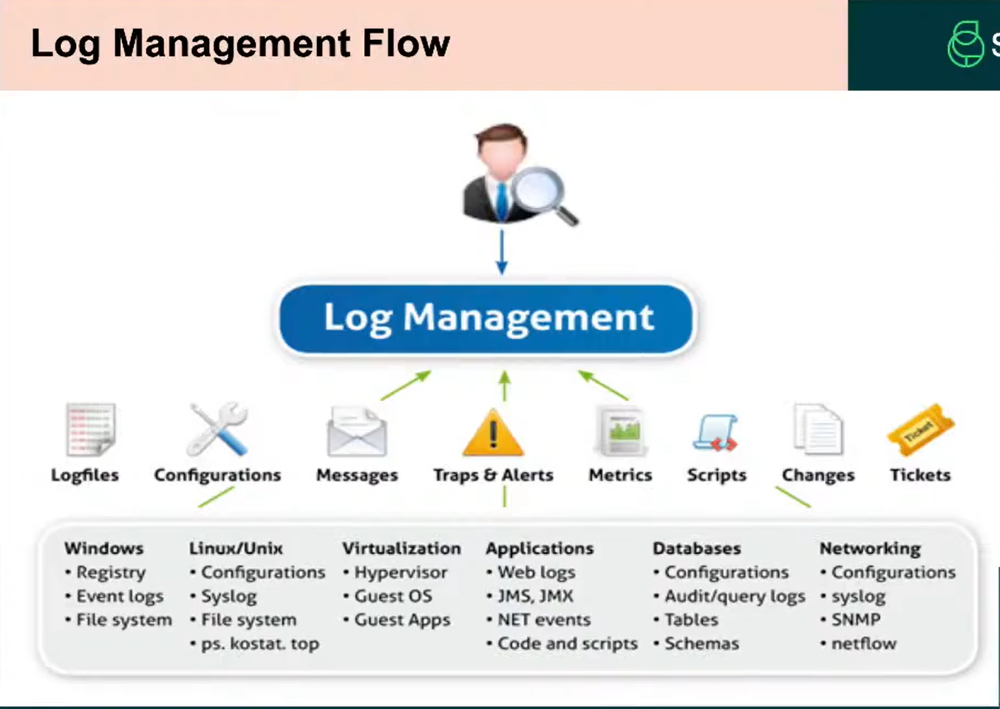

## Introduction to Logs - Types, Formats, Importance

Logs are records of events generated by OS applications, devices, and security tools. They are essential for:

- Monitoring activity
- Detecting Malicious behavior
- Forensic analysis
- Compliance & auditing

## Importance of Logs in Cybersecurity:

- _Incident Detection_ : Suspicious logins, unauthorized access attempts
- _Threat Hunting_ : Analysts proactively search logs for anomalies
- _Forensics_ : After a breach, logs help trace the attacker's path
- _Compliance_ : Logs are required for ISO, PCI-DSS, HIPAA, etc.
- _Correlation_ : SIEM Tools correlate logs from multiple sources for alerting

## Types of Logs:

| Log Type            | Sources                       | Use Cases                             |
| ------------------- | ----------------------------- | ------------------------------------- |
| System Logs         | OS(Windows, Linux)            | Boot, Shutdown, hardware issues       |
| Security Logs       | OS, AV, IDS/IPS               | Login attempts, Malware detection     |
| Application Logs    | Web, Db, Custom Apps          | App Errors, User Activity             |
| Firewall Logs       | Firewalls                     | Allowed/Blocked traffic, port scans   |
| Web Server Logs     | Apache, Nginx, IIS            | User agents, requests, URLs accessed  |
| Authentication Logs | Ad, Radius, LDAP              | Successful & Failed logins            |
| Authentication Logs | Ad, Radius, LDAP              | Successful & Failed logins            |
| Authentication Logs | Ad, Radius, LDAP              | Successful & Failed logins            |
| DNS Logs            | DNS Servers                   | Domain Resolution, Phishing Detection |
| Email Logs          | Mail Gateways                 | Spam/malware email, delivery reports  |
| Proxy Logs          | INternet Gateways             | User internet access Suspicious URLs  |
| Cloud Logs          | AWS CloudTrail, Azure Monitor | API Calls, Resources Usage            |

- LDAP = Lightweight directory access protocol

- **Log LifeCycle & Flow**
  - Generation : User logs in, a log in generated
  - Collection : Agent collects it (e.g. Wazuh, Beats)
  - Forwarding : Send to a central server or SIEM
  - Normalization : Converted to a standard format
  - Analysis & Correlation : SOC analysts monitor
  - Storage & Archiving : For compliance

- Log management Flows
  

- **What is Loggly ?**
  - loggly is a cloud-based log management and analytics platform that allows you to :
  - Collect logs from multiple sources (servers, apps, cloud infra)
  - Visualize logs using dashboards.
  - Set up alerts and anamaly detection
  - Centralize, index, and search logs in real-time

- **How to use Loggly**
  - Open Loggly select windows
  - Step 1: Install Nxlog
  - Step 2: Copy the Configuration
  - Step 3: Restart Nxlog
