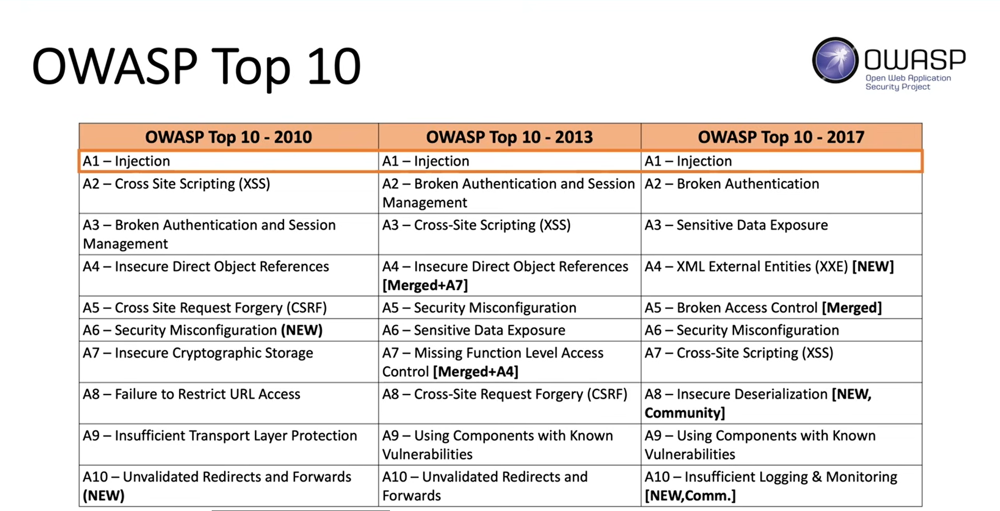

### Impact of SQL Injection Attacks

- Unauthorized access to sensitive data
  - Confidentiality : Sqli can be used to view sensitive information, such as application usernames and passwords
  - Integrity : SQLi can be used to alter data in the database
  - Availability: SQLi can be used to delete data in the database
- Remote Code execution on the OS.

---

## OWASP(Open Web Application Security Project) Top 10



---

## Types of SQL Injection

- **_SQL Injection_**
  - **In-Band (Classic)**
    - _Error_
    - _Union_
  - **Inferential (Blind)**
    - _Boolean_
    - _Time_
  - **Out-of-Band**

---

# In-Band SQL Injection (Classic)

- In-band SQLi occurs when the attacker uses the same communication channel to both launch the attack and gather the result of the attack.
  - Retrieved data is presented directly in the application web page
- Easier to exploit than other categories of SQLi
- Two Common types of in-band SQLi
  - Error-based SQLi
  - Union-based SQLi

## Error-based SQLi

- Error-based SQLi is an in-band SQLi technique that forces the database to generate an error, giving the attacker information upon which to refine their injection.
- Example :
  - Input: www.random.com/app.php?id='
  - Output: You have an error in your SQL syntax, check the manual that corresponds to your MySQL server version....

## Union-based SQLi

- Union-based SQLi is an in-band SQLi technique that leverages the UNION SQL operator to combine the results of two queries into a single result set
- Example :
  - Input: "?id=UNION SELECT username password FROM users--"

```bash
#  Output:
$ carlos
```

---

# Inferential (Blind)

- SQLi vulnerability where there is no actual transfer of data via the web application.
- Just as dangerous as in-band SQL injection
  - Attacker able to reconstruct the information by sending particular requests and observing the resulting behavior of the DB server
- Takes longer to exploit than in-band SQL injection
- Two common types of blind SQLi
  - Boolean-based SQLi
  - Time-based SQLi

## Boolean-based SQLi

- Boolean-based SQli is a blind SQLi technique that uses Boolean conditions to return a different result depending on whether the query returns a TRUE or False result

## Time-based Blind SQLi

- Time-based SQLi is a blind technique that relies on the database pausing for a specified amount of time, them returning the results, indicating a successful SQL query execution.
- Example Query: If the first character of the administrator's hashed password is an a , wait for 10 seconds.
  - response takes 10 seconds -> First letter is 'a'
  - response doesn't 10 takes seconds -> First letter is not 'a'

---

# Out-of-Band

- Vulnerability that consists of triggering an out-of-band network connection to a system that you control.
  - Not common
  - A variety of protocols can be used (ex. DNS, HTTP)
- Example Payload:

---

## How to Find SQLi vulnerabilities

- Depends on the perspective of testing
  - Black Box Testing
  - White Box Testing

---

# NEW
